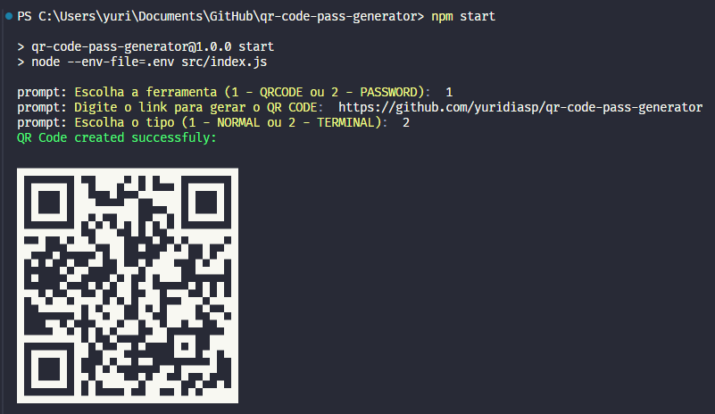
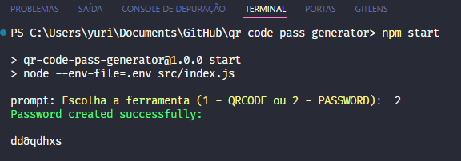

# QR Code Pass Generator

<div align="center">
    
    
</div>

## Descrição

O **QR Code Pass Generator** é um aplicativo que permite aos usuários gerar códigos QR e senhas seguras. A aplicação é interativa, solicitando ao usuário que escolha entre criar um código QR ou gerar uma senha.

## Estrutura do Projeto

```
QR-Code-Pass-Generator/
│
├── node_modules/
│
├── src/
│   ├── prompts-schema/
│   │   ├── prompt-schema-main.js
│   │   └── prompt-schema-qrcode.js
│   └── services/
│       ├── password/
│       │   └── utils/
│       │       ├── permitted-characters.js
│       │       ├── create.js
│       │       └─── handle.js
│       ├── qr-code/
│       │   ├── create.js
│       │   └─── handle.js
│       └─── index.js
│
├── .env
├── .env.example
├── .gitignore
├── LICENSE
├── package-lock.json
├── package.json
└── README.md
```

## Instalação

1. Clone o repositório para sua máquina local:
    ```sh
    git clone https://github.com/yuridiasp/qr-code-pass-generator.git
    ```

2. Navegue até o diretório do projeto:
    ```sh
    cd qr-code-pass-generator
    ```

3. Instale as dependências:
    ```sh
    npm install
    ```

4. Configure seu arquivo `.env` baseado no `.env.example`.

## Uso

Para iniciar a aplicação, utilize o comando:

```sh
npm start
```

Você será solicitado a escolher entre as opções de gerar um código QR ou criar uma senha.

### Estrutura do Código

- **src/index.js**: O ponto de entrada da aplicação. Solicita ao usuário escolher uma ação e executa a função correspondente.
  
    ```javascript
    import prompt from "prompt";
    import { mainPrompt } from "./prompts/prompt-main.js";
    import createQRCode from "./services/qr-code/create.js";
    import createPassword from "./services/password/create.js"

    (async function main() {
        prompt.get(mainPrompt, async (err, choose) => {
            if (choose.select == 1) {
                createQRCode()
            }

            if (choose.select == 2) {
                createPassword()
            }
        });

        prompt.start()
    })();
    ```

- **src/prompts/prompt-main.js**: Define a estrutura do prompt que é exibido ao usuário.

- **src/services/password/**: Contém as funcionalidades relacionadas à criação de senhas.
  - **utils/permitted-characters.js**: Define os caracteres permitidos na geração de senhas.
  - **create.js**: Função principal para criar senhas.
  - **handle.js**: Manipulador de operações relacionadas à senha.

- **src/services/qr-code/**: Contém as funcionalidades relacionadas à criação de códigos QR.
  - **create.js**: Função principal para criar códigos QR.
  - **handle.js**: Manipulador de operações relacionadas ao código QR.


## Licença

Distribuído sob a licença MIT. Veja `LICENSE` para mais informações.

## Desenvolvedor

<p>
    <a href="https://github.com/yuridiasp">
        
    </a>
      <p>
        <p>&nbsp&nbsp<a style="color: white;" href="https://github.com/yuridiasp">Yuri Dias</a><br>
        &nbsp&nbsp&nbsp
    </p>
</p>

<br>

[](https://www.linkedin.com/in/yuridiasp/) [](https://discord.com/channels/@yuridiasp/) [](https://www.facebook.com/yuri.dias.7739/) [](https://x.com/YuriDias_P) [](https://www.instagram.com/yuridiasp/) [](mailto:yuristardias@hotmail.com)